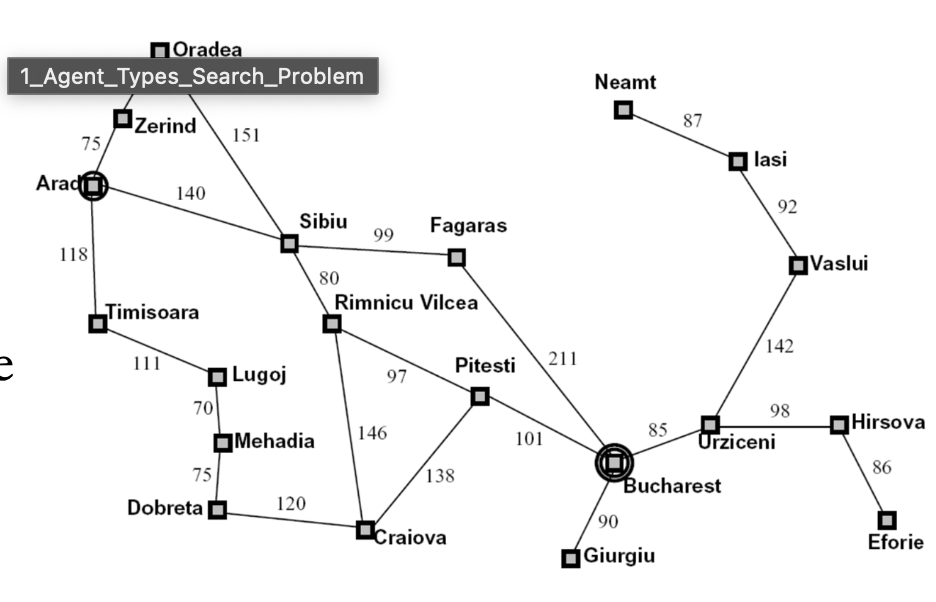

# Agent Types Search Problem Notes

## Agents and Environments

An agent is anything that can be viewed as perceiving its environment through sensors and acting upon that environment through actuators.

- Perception (sensors)
- Action (actuators)
- Reasoning / cognition (brain)

The job of AI is to design an **agent program** that implements the agent function- the mapping from percepts to actions.

4 basic kinds of agent programs that embody the principles underlying almost all intelligent systems:

- Simple reflex agents
- Model-based reflex agents
- Goal-based agents
- Utility-based agents

They can be converted into learning-based agents

## Reflex Agents

Reflex agents choose action based on current percept (and maybe memory). They may have memory or a model of the world's current state. They do not consider the future consequences of their actions. They consider how the world IS.

Can a reflex agent be rational? Not really. Only if the environment is fully observed.

### Example: Vacuum-Cleaner World

Simple reflex agent:

```
if status == Dirty then return Suck
else if location == A then return Right
else if location == B then return Left
```

Key difference between simple/model-based reflex agents:
- Simple reflex: Acts only on current percept -> Can waste moves.
- Model-based: Uses current percept + memory -> More efficient in partially observable environments.

Model-based reflex agent:
- Maintains an internal state (memory) about the environment.
- Uses a model of how the world changes to interpret percepts.

Example:
- Perceives (A, Clean) -> Updates memory: A = Clean.
- Remember B was Dirty earlier.
- Moves to B and cleans it.
- Avoids revisiting A unnecessarily unless dirt can reappear.

## Planning Agents

Planning agents ask "what if". Decisions based on (hypothesized) **consequences of actions.** They must have a model of how the world revolves in response to actions. They must formulate a goal (test). They consider how the world WOULD BE- taking the future into account.

- Optimal vs. complete planning
- Planning vs. replanning

## Learning-Based Agent

Learning-Based agents improve their performance over time by learning from experience, rather than relying only on predefined rules or models. They start with minimal built-in knowledge about how to behave. They interact with the environment and learn by updating knowledge of the world and improving its decision-making rules or models. The goal is better performance on its task according to its performance measure.

## Search Problems are Models

Real world problems:
- Route finding
- Traveling salesman problem
- VLSI layout
    - Positioning of millions of components and connections on a chip.
- Robot navigation
- Protein design
- Part-of-speech tagging
- Machine translation
- etc.

## Definition: Search Problem

- S_start: starting state
- Action(s): possible actions
- Cost(s, a): action cost
- Succ(s, a): successor
- IsEnd(s): reached end state?

### Example: Traveling in Romania



- State space:
    - Cities
- Successor function:
    - Roads: Go to adjacent city with cost = distance
- Start state:
    - Arad
- Goal test:
    - Is state == Bucharest?

Solution?

## What's in a State Space?

Different ways to say.

**World state** includes every last detail of the environment.

A **state** contains all information necessary to predict the effects of an action and to determine if it is a goal state.

A **state** is a summary of all the past actions sufficient to choose future action optimally.

**Search state** keeps only the details needed for planning.

### Vacuum World

State-space graph:
- Actions: Suck, Left, Right
- Goal: every cell is clean
- Cost: 1 for each action

\# of state:
- Agent in either cell, 2
- Left cell has dirt or not, 2
- Right cell has dirt or not, 2
- 2x2x2 = 8

## Agents that Plan Ahead

Search problems can be solved by goal-based agents.

- Uniformed search methods:
    - DFS
    - Backtracking Search
    - BFS
    - DP
    - Uniform-Cost Search
- Informed Search (heuristic)
    - Best first
    - A*

Example: Find the minimum cost path from city 1 to city n, going only forward. It cost $c_{ij}$ to go from i to j.
