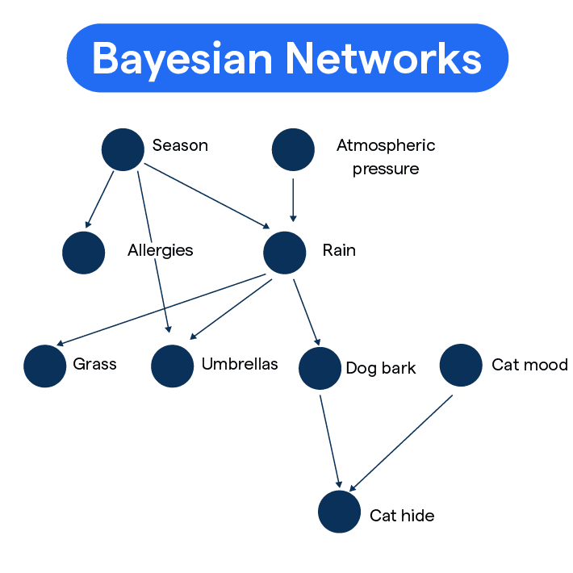

# Bayesian Networks

A **Bayesian Network (BN)** is a type of probabilistic graphical model that represents a set of random variables and their conditional dependencies using a **directed acyclic graph (DAG)**. They are widely used in statistics, ML, and AI for reasoning under uncertainty.

## Key Components

1. **Nodes**
Each node in the graph represents a random variable. These can be discrete (e.g. "rain" = {yes, no}) or continuous (e.g. temperature).

2. **Edges**
Directed edges (arrows) between nodes represent conditional dependencies. If there's an arrow from A to B, then B depends (directly) on A.

3. **Conditional Probability Tables (CPTs)**
Each node has an associated conditional probability distribution that specifies how it depends on its parent nodes.
    - For example: $P(Traffic | Rain, Accident)$.

## How It Works
The structure encodes causal or statistical relationships. The full joint probability distribution of all variables can be factored into the product of local conditional probabilities:

$P(X_1, X_2, \dots, X_n) = \prod_{i=1}^{n} P(X_i | Parents(X_i))$

- On the left hand side: $P(X_1, X_2, \dots, X_n)$ is the **joint probability distribution** of all variables in the network. That's the "big picture": the probability of every possible configuration of all variables.

- On the right-hand side: Instead of storing or computing the huge joint distribution directly, we break it down into a product of **local conditional probabilities**:
    - Each term $P(X_i | Parents(X_i))$ says: the probability of variable $X_i$ depends only on its direct parents in the graph.
    - If a node has no parents, it just become $P(X_i)$- a prior probability.

This factorization makes inference and learning much more efficient.

## Example

Imagine a simple network about whether you'll be late for work:

- Rain --> Traffic --> Late for Work
- Nodes: Rain, Traffic, Late for Work
- Relationships: Rain increases the chance of heavy traffic, which increases the chance of being late.

Each node has probabilities like:
- $P(Rain)$
- $P(Traffic | Rain)$
- $P(Late | Traffic)$

From this, you can calculate probabilities such as $P(Late | Rain)$.
