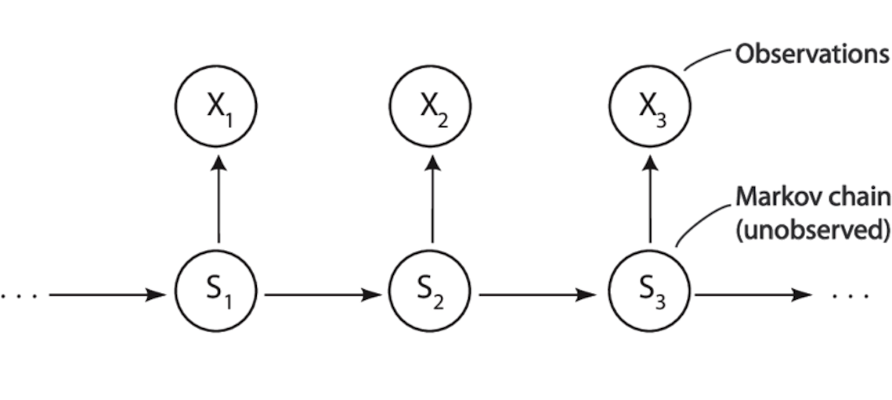

# Hidden Markov Models

A **Hidden Markov Model** is a statistical model that represents systems that evolve over time in a sequence, where:
- The system has hidden states (you don't observe them directly).
- You only see observations that are generated by those hidden states.
- The states evolve according to the **Markov property**: the next state depends only on the current state, not the whole past.

Think of it as:
- A hidden process (states) you can't see directly.
- An observed process (outputs) you can measure.

## Components

1. **States**:  
A finite set of hidden states $S = {s_1, s_2, \dots, s_N}$.  
Example: $Weather = {Sunny, Rainy}$.

2. **Observations:**.  
A set of possible visible symbols or outputs $V = {v_1, v_2, \dots, v_M}$.  
Example: $Activities = {Walk, Shop, Clean}.

3. **Initial state probabilies $(\pi)$**.  
$\pi {i} = P(Start in state s_i)$.

4. **Transition probabilies $(A)$**.  
$a_{ij} = P(next state s_j | current state s_i)$.

5. **Emission probabilities $(B)$**.  
$b_{j}(k) = P(observation v_k | state s_j)$.

So an HMM is usually denoted as:  
$\lambda = (A, B, \pi)$.

## Example (Weather --> Activities)

Imagine you're trying to guess the weather based on your friend's daily activity:
- **Hidden states**: $Weather = {Sunny, Rainy}$ (you don't observe this directly).
- **Observations**: $Activities = {Walk, Shop, Clean}$ (you see these).
- **Probabilities**:
    - If it's Sunny, friends usually walks (60%), sometimes Shops (30%), rarely cleans (10%).
    - If it's Rainy, friend usually Cleans (50%), sometimes Shops (40%), rarely walks (10%).
From only seeing the activities, you want to infer the hidden weather sequence. 

## Key Problems in HMMs

There are three fundamental tasks: 
1. **Evaluation** (Likelihood):  
Given a sequence of observations, what is the probability that the model produced it? (Solved by the **Forward Algorithm**).

2. **Decoding** (Most likely state sequence):  
Given observations, what sequence of hidden states is most likely?  
(Solved by the **Viterbi Algorithm**.)

3. **Learning** (Training):  
Given observations but not the model, how do we estimate A, B, $\pi$?  
(Solved by the **Baum-Welch Algorithm**, a special case of Expectation-Maximization.)

Overall, a HMM is a probabilistic model for sequences, where you assume there's an unobserved (hidden) process generating the observed data, and the system evolves with Markov dependencies. 
