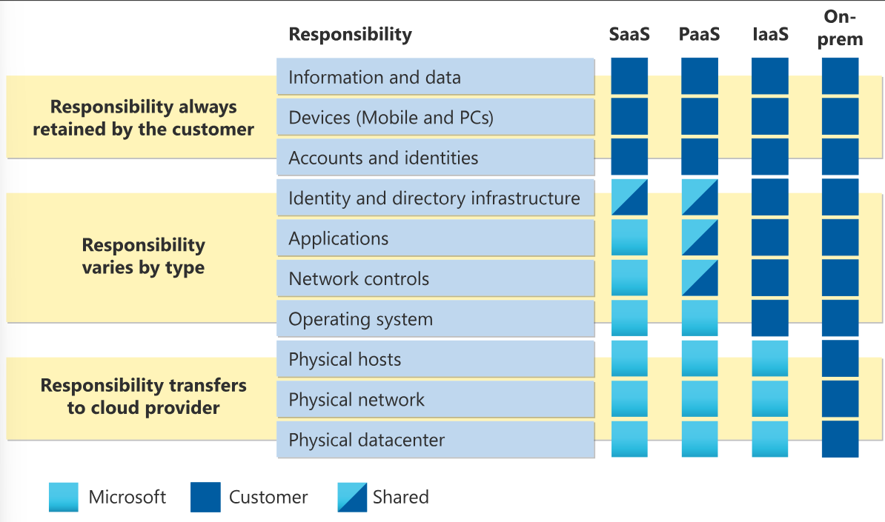
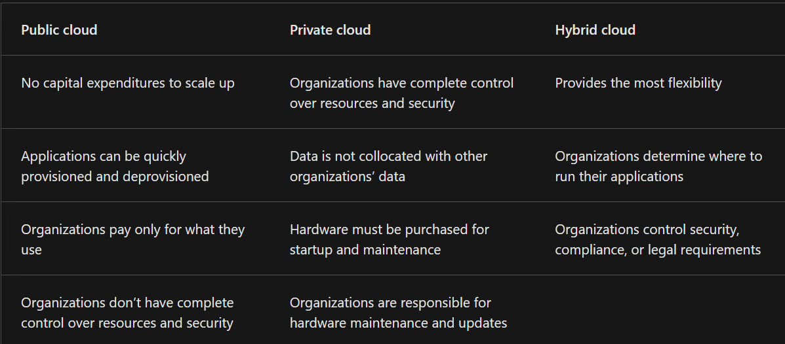

# Microsoft Certified: Azure Fundamentals
## AZ-900 Notes

#### Peyton Gardner  
#### 12/17/2024  

## Part 1: Describe Cloud Concepts

### Describe cloud computing  

Microsoft Azure is a cloud computing platform with many different services to meet business goals. They can range from simple to complex.  

#### High Level Overview of Services

- Web services for hosting business presence  
- Running fully virtualized computers managing custom software solutions  
- Remote storage  
- Database hosting  
- Centralized account management  
- AI  
- IoT  

#### AZ-900 Domain Areas

- Describe cloud concepts (25-30%)  
- Describe Azure architecture and services (35-40%)  
- Describe Azure management and governance (30-35%)  

#### Cloud Computing  

**Cloud computing**- Delivery of computing services over the internet. 

Since cloud computing uses the internet to deliver services, it doesn't have to be constrained by physical infrastructure. You can use the cloud to rapidly expand your IT footprint without building new physical machines.  

#### Shared Responsibility Model

The responsibilities of the cloud are split between the cloud provided and the consumer. The provider is responsible for physical security, power, cooling, and network connectivity. The consumer is responsible for the data and information stored in the cloud and access security. With a physical data center, you are responsible for everything.  

- Infrastructure as a Service (IaaS)  
- Platform as a service (PaaS)  
- Software as a service (SaaS)  

IaaS places the most responsibility on the consumer, with the cloud provider being responsible for the basics of physical security, power and connectivity. On the other hand, SaaS places most of the responsibility with the cloud provider. PaaS, being a middle ground between IaaS and Saas, rests somewhere in the middle. It evenly distributes responsibility between the cloud provider and the consumer.  

  

When using a cloud provider, you'll always be responsible for:  

- The information stored in the cloud  
- Devices that are allowed to connect to your cloud (cell phones, computers, etc.)  
- The accounts and identities of the people, services, and devices within your organization  

The cloud provider is always responsible for:  

- The physical data center  
- The physical network  
- The physical hosts  

Your service model will determine responsibility for things like:  

- Operating systems  
- Network controls  
- Applications  
- Identity and infrastructure  

#### Cloud Models  

Cloud models define the deployment type of cloud resources. The three main cloud models are: **private**, **public**, and **hybrid**.

**Private Cloud**- the natural evolution from a corporate data center. It's a cloud (delivering IT services over the internet) that's used by a single entity. Private cloud provides much greater control for the company and its IT department. However, it comes with greater costs and fewer benefits of a public cloud deployment. Finally, a private cloud can be hosted on-site, off-site, or by a third-party.  

**Public Cloud**- built, controlled, and maintained by a third-party provider. With a public cloud, anyone that wants to purchase cloud services can access and use resources. The general public availability is a key different between public and private clouds.  

**Hybrid cloud**- uses both public and private clouds in an inter-connected environment. They are used to allow a private cloud to surge for increased, temporary demand by deploying public cloud resources. They can also be used to provide an extra layer of security.  

  

**Multi-cloud**- you use multiple public cloud providers. You manage resources and security in both environments.   

**Azure Arc**- a set of technologies that helps manage your cloud environment. They can manage any cloud environment.  

**Azure VMware Solution**- lets you run your VMware workloads in Azure with easy integration and scalability.  

#### Consumption-based Model

When comparing IT infrastructure, there are two types of expenses to consider:  

1. **Capital Expenditure (CapEx)**- a one-time, up-front expenditure to purchase or secure physical resources.  

2. **Operational Expenditure (OpEx)**- spending money on services or products over time. Cloud computing falls under this because it operates on a consumption-based model. You don't pay for the physical infrastructure. Instead, you pay for the IT resources you use.  

This model has many benefits:  

- No upfront costs  
- No need to purchase and manage infrastructure that users may not use to its fullest potential  
- Pay for more resource when needed  
- Stop paying for resources when they're no longer needed  

In short, you only pay for what you use.  

### Describe the benefits of using cloud services

#### Benefits of high availability and scalability in the cloud

The two biggest considerations when building or deploying a cloud application are uptime (availability) and the ability to handle demand (scale).

**High availability**- it is important that resources are available when needed. High availability focuses on ensuring maximum availability, regardless of disruptions or other events that may occur.  

Azure is a highly available cloud environment with uptime gurantees depending on the service. These gurantees are part of the service-level agreements (SLAs). SLAs contain the uptime and down time for service. If these agreements are not met, the customer is entitled to a credit. For example, the SLA may state that there will be 100% up time and 0% down time. It is relatively rare to have 100% up time. They are closer to 99%-99.9%. 

**Scalability**- refers to the ability to adjust resources to meet demand. A benefit is you aren't overpaying for services (see consumption-based model above). Scaling comes in two varieties: vertical and horizontal. Vertical scaling is focused on increasing or decreasing the capabilities of resources. Horizontal scaling is adding or subtracting the number of resources.

#### Benefits of reliability and predictability in the cloud

**Reliability**- the ability of a system to recover from failures and continue to function. The cloud naturally supports a reliable and resilient infrastructure. 

**Predictability**- allows you to move forward with confidence. It can be focused on performance or cost predictability. Performance predictability focuses on predicting the resources needed to deliver a positive experience for your customers. 

#### Benefits of security and governance in the cloud

